# <div align="center"> 🚌 TrackDIU — Campus Transit Tracker </div>

<div align="center">
  <p><strong>A modern Flutter application for real-time bus tracking and transit management at DIU</strong></p>
  <p><em>Developed by Maruf Hossain</em></p>
</div>

---

## 📋 Overview

**TrackDIU** is a comprehensive campus transit tracking solution designed for Daffodil International University (DIU). Built with Flutter and powered by Supabase and Google Maps, this app provides students, staff, and faculty with real-time bus location tracking, schedules, and transit information.

---

## ✨ Features

| Feature | Status |
|---------|--------|
| **Real-Time Bus Tracking** | ✅ |
| **Interactive Google Maps Integration** | ✅ |
| **Bus Route Visualization** | ✅ |
| **Schedule Management** | ✅ |
| **Current Location Access** | ✅ |
| **Dark Mode Support** | ✅ |
| **Local Caching (Offline Support)** | ✅ |
| **User Authentication** | ✅ |
| **Polyline Route Drawing** | ✅ |
| **Geolocation Services** | ✅ |
| **Search & Filtering** | ✅ |
| **Push Notifications** | ✅ |

---

## 🖼️ App Flow & Screenshots

<details>
<summary><strong>📸 View Screenshots</strong></summary>

| Screenshot 1 | Screenshot 2 |
|-------------|-------------|
| 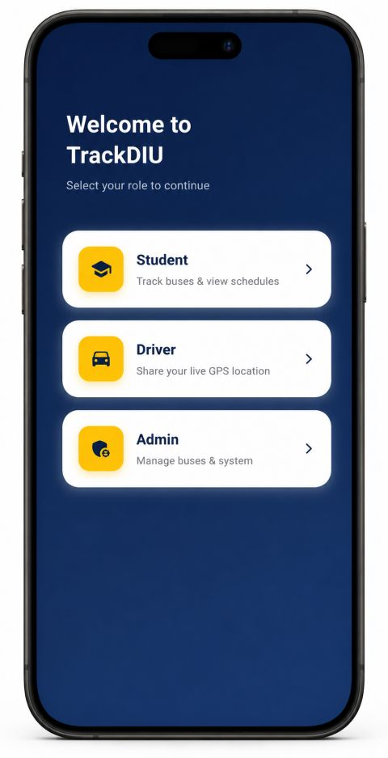 | 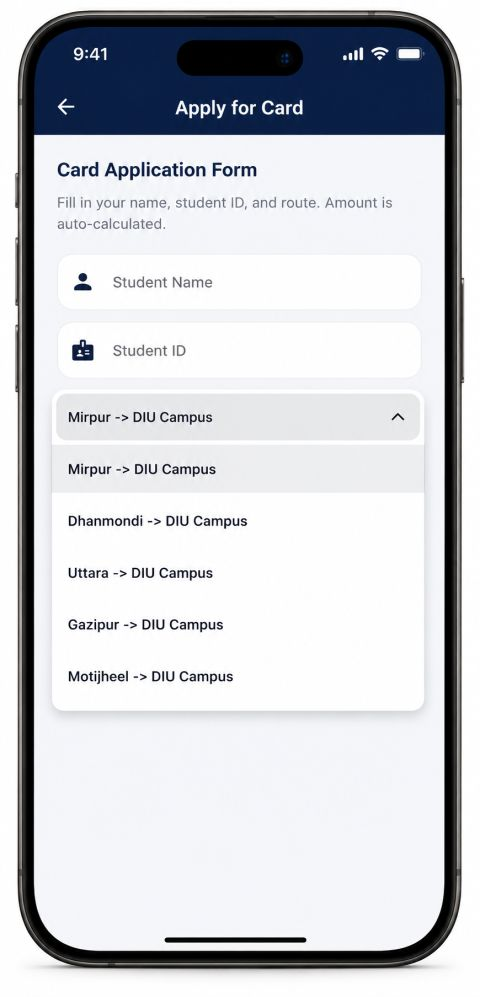 |

| Screenshot 3 | Screenshot 4 |
|-------------|-------------|
| 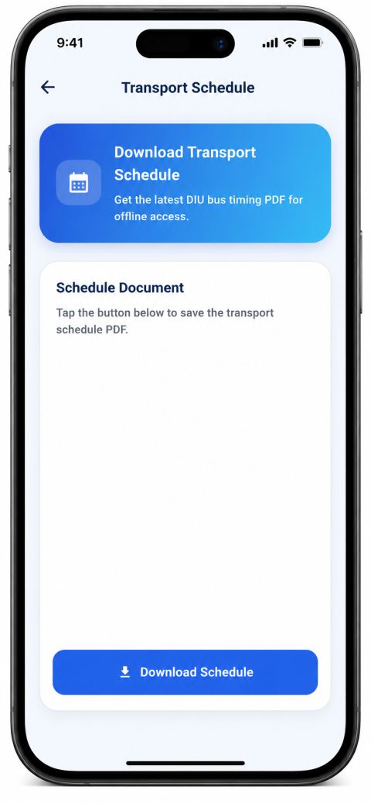 | 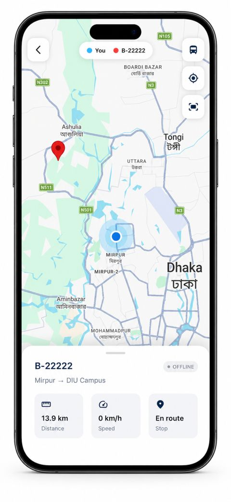 |

| Screenshot 5 | Screenshot 6 |
|-------------|-------------|
| 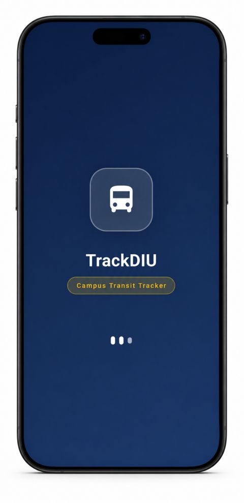 | 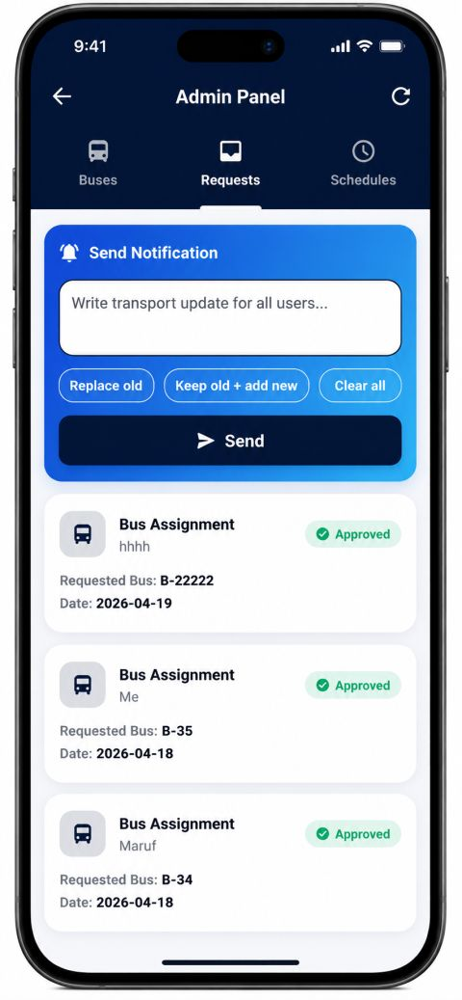 |

| Screenshot 7 | Screenshot 8 |
|-------------|-------------|
| 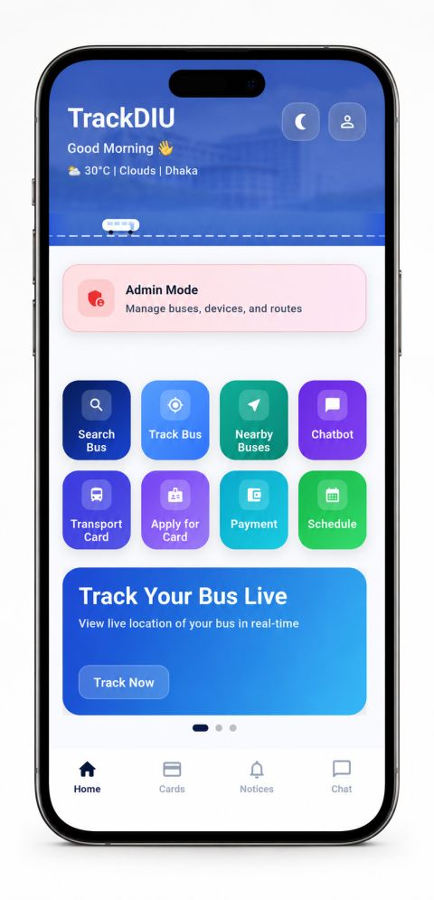 | 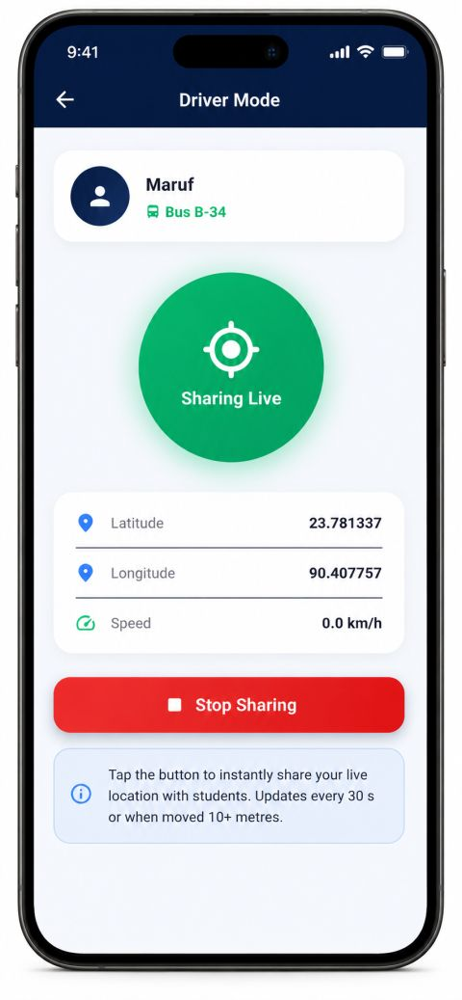 |

| Screenshot 9 | Screenshot 10 |
|-------------|-------------|
| 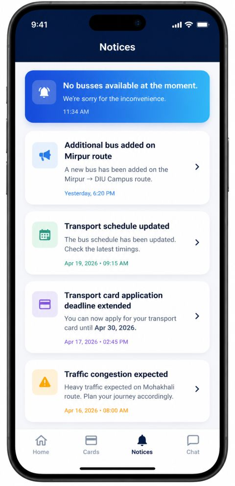 |  |

| Screenshot 11 | Screenshot 12 |
|-------------|-------------|
| 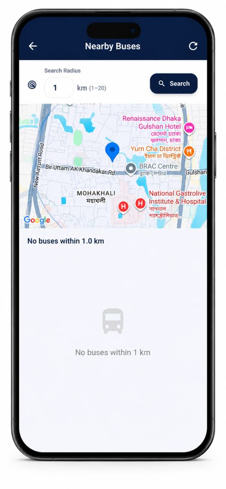 | 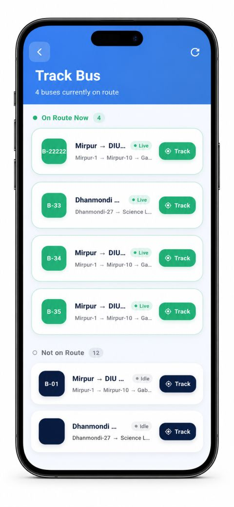 |

| Screenshot 13 | Dark Mode |
|-------------|-------------|
| 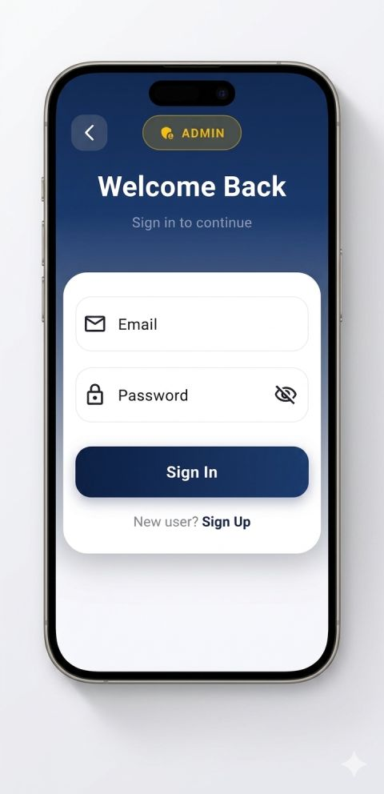 |  |

</details>

---

## 🛠️ Tech Stack

### **Framework & Language**
- **Framework:** Flutter 3.0+
- **Language:** Dart 3.0+

### **Backend & Database**
- **Backend:** Supabase (PostgreSQL-based Backend-as-a-Service)
- **Real-time Database:** Supabase Realtime
- **Authentication:** Supabase Auth

### **Maps & Location**
- **Google Maps:** `google_maps_flutter` v2.5.3
- **Geolocation:** `geolocator` v12.0.0
- **Geocoding:** `geocoding` v4.0.0
- **Polyline Rendering:** `flutter_polyline_points` v2.1.0
- **Location Permissions:** `permission_handler` v11.3.1

### **State Management**
- **Riverpod:** v2.5.1 (Reactive caching & dependency injection)

### **Local Storage**
- **Hive:** v1.1.0 (Lightweight NoSQL database for offline caching)

### **Animations & UI**
- **Animations Package:** v2.0.11
- **Lottie:** v3.1.2 (Animated illustrations)
- **Google Fonts:** v6.2.1 (Custom typography)

### **Additional Packages**
- **HTTP Client:** `http` v1.2.2
- **URL Launcher:** `url_launcher` v6.3.1
- **Cached Network Images:** `cached_network_image` v3.4.1
- **Internationalization:** `intl` v0.19.0
- **Path Provider:** `path_provider` v2.1.5
- **Material Design:** Cupertino Icons v1.0.8

---

## 📥 Installation & Setup

### **Prerequisites**
- Flutter SDK 3.0 or higher
- Dart 3.0 or higher
- Android Studio / Xcode (for emulator)
- A Supabase project with API credentials

### **Step 1: Clone the Repository**
```bash
git clone https://github.com/marufhossain19/TrackDIU.git
cd TrackDIU
```

### **Step 2: Install Dependencies**
```bash
flutter pub get
```

### **Step 3: Configure Supabase**
Update `lib/core/constants.dart` with your Supabase credentials:
```dart
class AppConstants {
  static const String supabaseUrl = 'YOUR_SUPABASE_URL';
  static const String supabaseAnonKey = 'YOUR_SUPABASE_ANON_KEY';
  static const String googleMapsApiKey = 'YOUR_GOOGLE_MAPS_API_KEY';
}
```

### **Step 4: Google Maps API Key**
- Generate a Google Maps API key from [Google Cloud Console](https://console.cloud.google.com/)
- Add it to your Android `AndroidManifest.xml` and iOS `Info.plist`

### **Step 5: Run the App**
```bash
flutter run
```

---

## 📱 Android APK Installation Guide

Want to install the app directly on your Android device? Follow these quick steps! 🚀

### **Step 1: Download the APK**
Point to the `.apk` file in your downloads folder.

### **Step 2: Enable Unknown Sources**
Since the app is not from Google Play Store, grant permission to install it:
- Open **Settings ⚙️** > **Apps** (or **Security** / **Privacy**)
- Tap **Special app access**
- Find **Install Unknown Apps**
- Select your download app (Chrome, Google Drive, File Manager) and toggle **"Allow from this source"** ✅

### **Step 3: Install the App**
Tap the downloaded `.apk` file and press **Install**.

### **Step 4: Launch & Enjoy**
Open **TrackDIU**, grant location permissions 📍, and start tracking your campus bus! 🌟

---

## 🚀 Usage Guide

### **Main Features**

#### **1. Bus Tracking**
- View real-time bus locations on the map
- Track multiple buses simultaneously
- See detailed bus information (route, driver, capacity)

#### **2. Schedule Management**
- View bus schedules for different routes
- Check arrival times at each stop
- Save favorite routes for quick access

#### **3. Route Visualization**
- See polyline routes on the map
- Identify bus stops along the route
- Calculate distance and estimated time

#### **4. Dark Mode**
- Toggle between light and dark themes
- Automatic theme switching based on system preference
- Smooth transitions between modes

#### **5. Offline Support**
- Hive local caching ensures app works without internet
- Cached bus data, schedules, and settings
- Automatic sync when connection is restored

---

## 📱 Device Requirements

### **Android**
- Minimum SDK: 21
- Target SDK: 34+
- Permissions: Location, Internet, Maps

### **iOS**
- Minimum iOS: 11.0
- Permissions: Location, Maps

---

## 🔐 Authentication

TrackDIU uses **Supabase Authentication** for secure user access:
- Email/Password authentication
- Session management
- Role-based access control
- Real-time sync across devices

---

## 💾 Database Architecture

### **Supabase Tables**
- `buses` — Active bus information
- `routes` — Bus route details
- `schedules` — Timetable information
- `users` — User profiles and preferences
- `notifications` — Push notification tracking

### **Local Storage (Hive)**
- `busBox` — Cached bus data
- `scheduleBox` — Cached schedules
- `settingsBox` — User preferences & theme settings

---

## 🎨 UI/UX Highlights

- **Material 3 Design** with custom color schemes
- **Smooth Animations** using Lottie & Flutter animations
- **Responsive Layouts** adapting to all screen sizes
- **Accessibility Features** including text scaling prevention
- **Custom Fonts** with Google Fonts integration

---

## 📂 Project Structure

```
lib/
├── core/
│   ├── constants.dart       # App-wide constants & API keys
│   ├── theme.dart           # Light & dark theme definitions
│   └── utils/               # Helper utilities
├── features/
│   ├── auth/                # Authentication screens
│   ├── bus/                 # Bus tracking features
│   ├── schedule/            # Schedule management
│   ├── map/                 # Map integration
│   └── settings/            # User settings & preferences
├── providers/
│   ├── app_providers.dart   # Riverpod state management
│   └── auth_provider.dart   # Auth state management
├── widgets/
│   └── common_widgets.dart  # Reusable UI components
└── main.dart                # App entry point
```

---

## 🐛 Known Issues & Limitations

- Push notifications require additional Firebase/FCM setup
- Location permissions vary by Android/iOS versions
- Some features may require internet connection for full functionality

---

## 🔄 Future Enhancements

- [ ] Push notifications for bus arrival alerts
- [ ] Driver communication system
- [ ] Trip history and analytics
- [ ] Favorite stops bookmarking
- [ ] Multi-language support
- [ ] Web dashboard for administrators
- [ ] Wearable app support

---

## 📄 License

This project is open source and available under the MIT License.

---

## 👨‍💻 Developer

**Maruf Hossain**
- GitHub: [@marufhossain19](https://github.com/marufhossain19)
- Repository: [TrackDIU](https://github.com/marufhossain19/TrackDIU)

---

## 🤝 Contributing & Support

Found a bug or have suggestions? Feel free to:
- Open an [Issue](https://github.com/marufhossain19/TrackDIU/issues)
- Submit a [Pull Request](https://github.com/marufhossain19/TrackDIU/pulls)
- Fork and improve the project

---

<div align="center">
  <p><strong>⭐ If you find this project helpful, please consider giving it a star!</strong></p>
  <p><em>Made with ❤️ for seamless campus commutes! 🎓🚌</em></p>
  <p><strong>Happy tracking!</strong></p>
</div>
